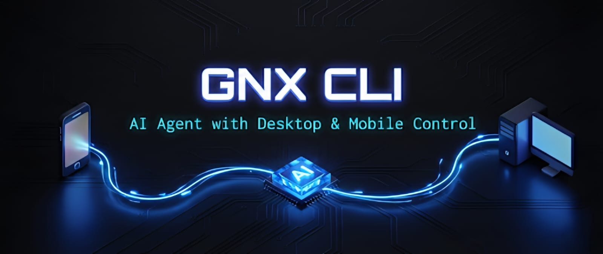
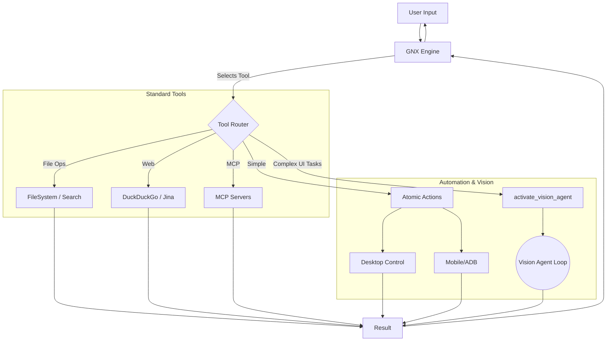
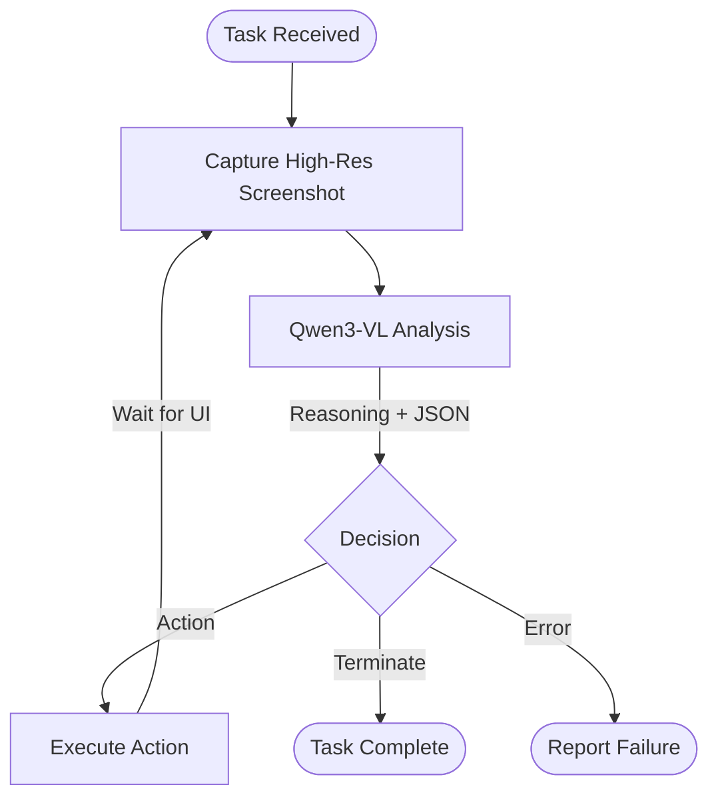

# GNX CLI - AI Agent with Desktop & Mobile Control



## Essential Project Badges
[](https://github.com/gokul6350/GNX-CLI)
[](https://github.com/gokul6350/GNX-CLI)
[](https://github.com/gokul6350/GNX-CLI/issues)

## AI Agent Theme Badges
[]()
[]()
[]()

## Status & Tech Badges
[](https://github.com/gokul6350/GNX-CLI/blob/main/LICENSE)


[](https://github.com/gokul6350/GNX-CLI/discussions)

**GNX CLI** is a next-generation AI agent capable of perceiving and manipulating real-world interfaces. Built on a modular architecture, it combines **Native Tool Calling** (Llama 4 Scout/Groq) for rapid logic with a specialized **Vision Agent** (Qwen3-VL/Novita) for high-fidelity UI automation on both desktop and mobile. Developed by **Gokulbarath**.

## 📱 Mobile Demo


https://github.com/user-attachments/assets/42a5fde6-f226-480d-ab10-94136493f4ac

This clip shows GNX CLI running a full mobile automation sequence from the latest build.

## 🖥️ Computer Demo


https://github.com/user-attachments/assets/bec3e8a0-30ce-4096-829c-8e6ca0fb33cd


## 🚀 Key Features

- **🧠 Hybrid Intelligence:** Fast orchestrator LLM (Llama 4, Gemini, or GLM) plus specialized VLM (Qwen3-VL) for sight.
- **👁️ Autonomous Vision Agent:** Sub-agent loop that can see screens, reason about UI, and act (click, swipe, type).
- **🔌 MCP Support:** Works with the Model Context Protocol (GitHub, Filesystem, Memory servers).
- **📱 Mobile Automation:** Deep ADB integration for taps, swipes, and text input.
- **💻 Desktop Automation:** Mouse/keyboard control via PyAutoGUI with visual feedback loops.
- **📁 Modular Tooling:** Atomic tools for file ops, web search, system control, and UI automation.


## 🏗️ Architecture


### High-Level Routing



#### Vision Agent Loop
When `activate_vision_agent` is called, the system switches to a VLM-driven feedback loop:



## 🛠️ Installation

### Requirements
- Python 3.10+
- Windows/Mac/Linux
- For mobile: ADB (Android Debug Bridge) and a connected Android device

### Setup

```bash
git clone https://github.com/Gokulbarath/GNX-CLI.git
cd "GNX CLI"

python -m venv .venv
.venv\Scripts\activate  # Mac/Linux: source .venv/bin/activate

pip install -r requirements.txt

# Configure environment
copy .env.example .env  # Mac/Linux: cp .env.example .env
```

## 💻 Usage

Start the CLI:

```bash
python main.py
```

### Example Commands

1. General reasoning & files
	- "List all python files in src/tools and tell me what they do."
2. Web search
	- "Search for the latest features in Python 3.13."
3. Vision Agent (mobile)
	- Ensure your Android device is connected via ADB.
	- "Open Settings, find 'Display', and turn on Dark Mode." (Agent navigates, scrolls, and taps based on visual cues.)
4. Vision Agent (desktop)
	- "Open Calculator, calculate 55 * 12, and tell me the result."


## 📂 Project Structure

```
GNX CLI/
├── main.py                     # Entry point
├── requirements.txt            # Dependencies
├── README.md                   # This file
├── imgs/                       # Assets (demo, architecture, LAMx)
├── src/
│   ├── agents/
│   │   └── vision/             # Vision agent loop & prompts
│   ├── gnx_engine/             # Orchestrator, adapters, prompts
│   ├── mcp/                    # Model Context Protocol client
│   ├── tools/
│   │   ├── desktop/            # Mouse/keyboard/screenshot
│   │   ├── mobile/             # ADB/touch/system
│   │   ├── handoff/            # Sub-agent triggers
│   │   ├── file_ops.py         # File operations
│   │   ├── filesystem.py       # Directory listing
│   │   ├── system.py           # System utilities
│   │   ├── search.py           # File search
│   │   ├── todos.py            # TODO management
│   │   ├── web_search.py       # Web search
│   │   └── ui_automation.py    # UI automation helpers
│   ├── ui/                     # Display utilities
│   ├── utils/                  # Logging, token counting
│   └── vision_client/          # VLM API client and types
└── .env.example                # Environment template
```

## 🧾 Environment Template

```text
# GNX CLI Environment Variables

# Groq API Key (primary orchestrator)
GROQ_API_KEY=your_groq_api_key_here

# Google Gemini API Key (fallback/alternative)
GOOGLE_API_KEY=your_google_api_key_here

# HuggingFace Token (for V_action vision model)
HF_TOKEN=your_huggingface_token_here

# ZhipuAI API Key (GLM-4.5 text-only series)
ZHIPUAI_API_KEY=your_zhipuai_api_key_here

# Default provider: glm | groq | gemini
GNX_DEFAULT_PROVIDER=glm

# Optional model overrides
# GROQ_MODEL=meta-llama/llama-4-scout-17b-16e-instruct
# GEMINI_MODEL=gemini-1.5-flash
# GLM_MODEL=glm-4.5
```


## 🗺️ Future Roadmap

- [ ] Web UI dashboard
- [ ] Performance optimization and caching
- [ ] Personalization

## 🔗 Part of LAMx Project

GNX CLI is a rewritten and evolved version of **[Axolot OS](https://github.com/gokul6350/Axolot-os)**, now optimized as a core component of the **LAMx** project—an integrated ecosystem for general AI-powered intelligence.


## 🤝 Contributing

Contributions are welcome! Please open an issue or submit a PR.

## 📜 License

MIT License — see the LICENSE file for details.

---

**Built with ❤️ after a lot of 💔**
