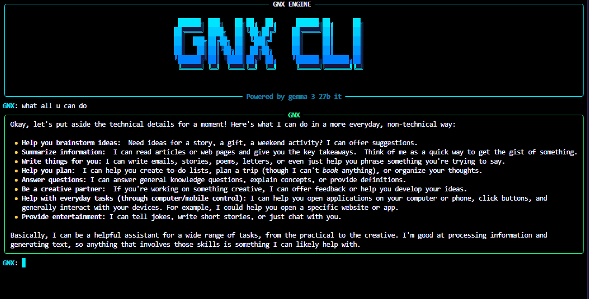
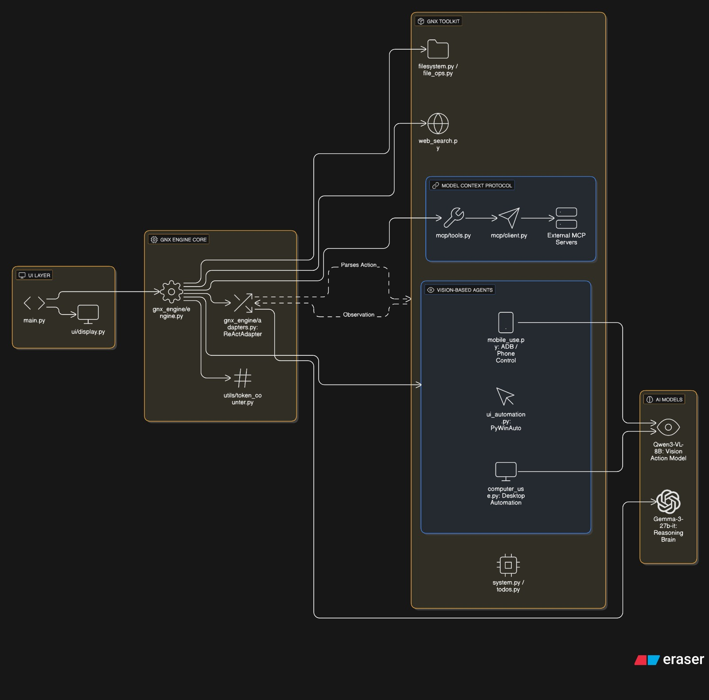
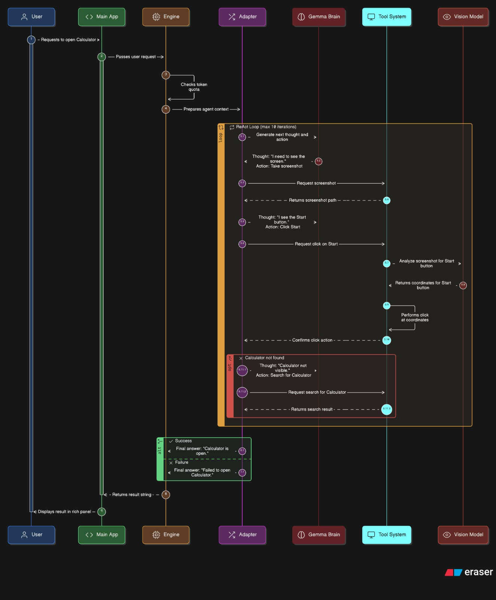
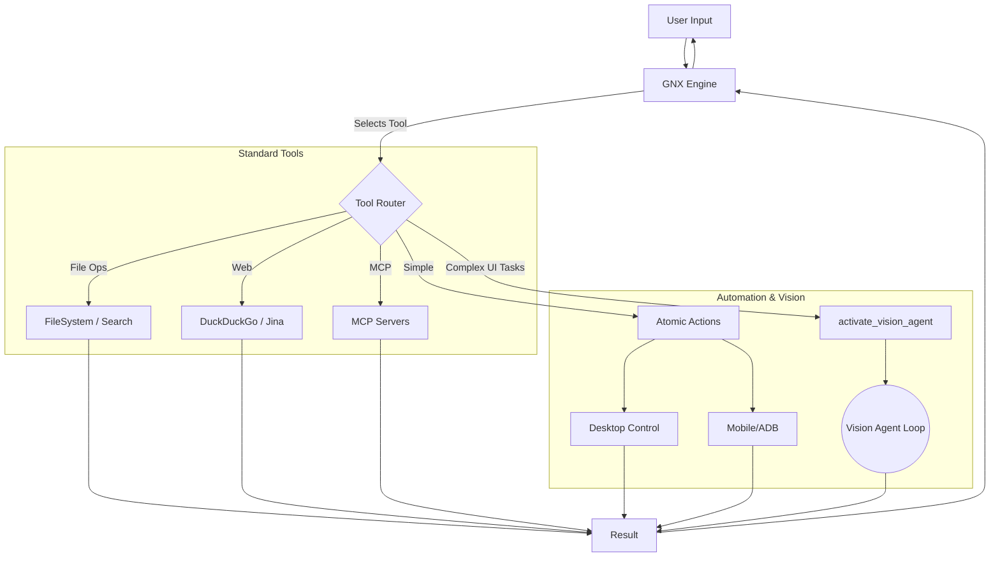

# GNX CLI - AI Agent with Desktop & Mobile Control


**GNX CLI** is a next-generation AI agent capable of perceiving and manipulating real-world interfaces. Built on a modular architecture, it combines **Native Tool Calling** (Llama 4 Scout/Groq) for rapid logic with a specialized **Vision Agent** (Qwen3-VL/Novita) for high-fidelity UI automation on both desktop and mobile. Developed by **Gokulbarath**.



## 🚀 Key Features

- **🧠 Hybrid Intelligence:** Fast orchestrator LLM (Llama 4, Gemini, or GLM) plus specialized VLM (Qwen3-VL) for sight.
- **👁️ Autonomous Vision Agent:** Sub-agent loop that can see screens, reason about UI, and act (click, swipe, type).
- **🔌 MCP Support:** Works with the Model Context Protocol (GitHub, Filesystem, Memory servers).
- **📱 Mobile Automation:** Deep ADB integration for taps, swipes, and text input.
- **💻 Desktop Automation:** Mouse/keyboard control via PyAutoGUI with visual feedback loops.
- **📁 Modular Tooling:** Atomic tools for file ops, web search, system control, and UI automation.

## 📱 Mobile Demo

<video controls width="700">
	 <source src="./imgs/GNX_CLI_MOBILE_DEMO.mov" type="video/quicktime">
	 Your browser does not support embedded video. [Download the demo](./imgs/GNX_CLI_MOBILE_DEMO.mov).
</video>

This clip shows GNX CLI running a full mobile automation sequence from the latest build.

## 🏗️ Architecture




### Workflow: User Goal → Llama 4 Scout → Action Execution

```
┌─────────────────────────────────────────────────────────────┐
│ 1. USER GOAL                                                │
│    "Open calculator on desktop"                             │
└────────────────┬────────────────────────────────────────────┘
					  │
					  ▼
┌─────────────────────────────────────────────────────────────┐
│ 2. LLAMA 4 SCOUT ENGINE (Main LLM)                          │
│    - Understands user intent                                │
│    - Native tool calling (no ReAct parsing needed)          │
│    - Multimodal vision for screenshot analysis              │
│    - Plans action sequence                                  │
└────────────────┬────────────────────────────────────────────┘
					  │
					  ▼
┌─────────────────────────────────────────────────────────────┐
│ 3. SCREENSHOT CAPTURE                                       │
│    - Takes current screen/phone screenshot                  │
│    - Sends image directly to Llama 4 Scout                  │
└────────────────┬────────────────────────────────────────────┘
					  │
					  ▼
┌─────────────────────────────────────────────────────────────┐
│ 4. NATIVE TOOL CALLING                                      │
│    - Model decides which tools to use                       │
│    - Returns structured tool calls                          │
│    - Handles images natively (multimodal)                   │
└────────────────┬────────────────────────────────────────────┘
					  │
					  ▼
┌─────────────────────────────────────────────────────────────┐
│ 5. ACTION EXECUTION                                         │
│    - Click/tap at coordinates                               │
│    - Type text                                              │
│    - Press hotkeys                                          │
│    - Swipe/drag                                             │
└────────────────┬────────────────────────────────────────────┘
					  │
					  ▼
┌─────────────────────────────────────────────────────────────┐
│ 6. VERIFICATION LOOP                                        │
│    - Take new screenshot                                    │
│    - Check if goal achieved                                 │
│    - Continue or report success                             │
└─────────────────────────────────────────────────────────────┘
```

### High-Level Routing



#### Vision Agent Loop
When `activate_vision_agent` is called, the system switches to a VLM-driven feedback loop:


## 🛠️ Installation

### Requirements
- Python 3.10+
- Windows/Mac/Linux
- For mobile: ADB (Android Debug Bridge) and a connected Android device

### Setup

```bash
git clone https://github.com/Gokulbarath/GNX-CLI.git
cd "GNX CLI"

python -m venv .venv
.venv\Scripts\activate  # Mac/Linux: source .venv/bin/activate

pip install -r requirements.txt

# Configure environment
copy .env.example .env  # Mac/Linux: cp .env.example .env
```

## 💻 Usage

Start the CLI:

```bash
python main.py
```

### Example Commands

1. General reasoning & files
	- "List all python files in src/tools and tell me what they do."
2. Web search
	- "Search for the latest features in Python 3.13."
3. Vision Agent (mobile)
	- Ensure your Android device is connected via ADB.
	- "Open Settings, find 'Display', and turn on Dark Mode." (Agent navigates, scrolls, and taps based on visual cues.)
4. Vision Agent (desktop)
	- "Open Calculator, calculate 55 * 12, and tell me the result."

#### Desktop Automation (sample transcript)
```
GNX: "Use computer use and open calculator"
✓ computer_screenshot: Screenshot captured
✓ computer_control: Click on Start button (679, 1047)
✓ computer_control: Type "calculator"
✓ computer_control: Click on Calculator app (725, 491)
✓ Task completed: Calculator opened successfully
```

#### Mobile Automation (sample transcript)
```
GNX: "Open Settings on my phone"
✓ mobile_devices: Connected devices found
✓ mobile_connect: Connected to device RZCX904D1QV
✓ mobile_screenshot: Screen captured
✓ mobile_control: Tap on Settings icon
✓ Task completed: Settings app opened
```

#### File Operations
```
GNX: "List all Python files in src folder"
GNX: "Read the contents of main.py"
GNX: "Create a new file called notes.txt with content 'Hello World'"
```

#### Web Search
```
GNX: "Search for latest Python 3.13 features"
GNX: "Fetch the content from github.com"
```

#### Task Management
```
GNX: "Create a TODO list with: Task 1, Task 2, Task 3"
GNX: "Show my TODO list"
GNX: "Mark the first task as complete"
```

## ⚙️ Configuration

GNX CLI uses environment variables (set in `.env`).

| Variable | Description | Required |
|----------|-------------|----------|
| GROQ_API_KEY | API key for Groq models (Llama 4 Scout) | Yes |
| GOOGLE_API_KEY | API key for Google Gemini models | No (fallback) |
| HF_TOKEN | HuggingFace token for V_action vision model | Optional |
| ZHIPUAI_API_KEY | API key for ZhipuAI's GLM-4.5 series (text-only, see GLMinfo.md) | Yes |
| GNX_DEFAULT_PROVIDER | Default LLM provider (`glm`, `groq`, or `gemini`) | No (default: `glm`) |

Quick setup:

```bash
cp .env.example .env
# edit .env with your keys
```

## 🔧 Tools Reference

### Desktop Control
```python
computer_screenshot()
computer_control(instruction="Click on the Start button")
computer_type_text(text="hello world", press_enter=True)
computer_hotkey(keys="ctrl,c")
computer_wait(seconds=2.0)
```

### Mobile Control
```python
mobile_devices()
mobile_connect(device_id="DEVICE_ID")
mobile_screenshot()
mobile_control(instruction="Tap on Settings icon")
mobile_tap(x=100, y=200)
mobile_swipe(direction="up")
mobile_button(button="back")
```

### File Operations
```python
ls(path="src")
read_file(path="main.py")
write_file(path="test.txt", content="Hello")
edit_file(path="test.txt", old="Hello", new="Hi")
glob(pattern="**/*.py")
grep(query="import", path="src")
```

## 🧭 Native Tool Calling

GNX uses **native tool calling** with Llama 4 Scout:

1. Understanding — Llama 4 Scout parses intent and visuals.
2. Tool selection — Model decides which tool(s) to invoke.
3. Execution — Tools run and return structured results.
4. Observation — Model inspects results/screenshots and continues or finishes.

## 📂 Project Structure

```
GNX CLI/
├── main.py                     # Entry point
├── requirements.txt            # Dependencies
├── README.md                   # This file
├── imgs/                       # Assets (demo, architecture, LAMx)
├── src/
│   ├── agents/
│   │   └── vision/             # Vision agent loop & prompts
│   ├── gnx_engine/             # Orchestrator, adapters, prompts
│   ├── mcp/                    # Model Context Protocol client
│   ├── tools/
│   │   ├── desktop/            # Mouse/keyboard/screenshot
│   │   ├── mobile/             # ADB/touch/system
│   │   ├── handoff/            # Sub-agent triggers
│   │   ├── file_ops.py         # File operations
│   │   ├── filesystem.py       # Directory listing
│   │   ├── system.py           # System utilities
│   │   ├── search.py           # File search
│   │   ├── todos.py            # TODO management
│   │   ├── web_search.py       # Web search
│   │   └── ui_automation.py    # UI automation helpers
│   ├── ui/                     # Display utilities
│   ├── utils/                  # Logging, token counting
│   └── vision_client/          # VLM API client and types
└── .env.example                # Environment template
```

## 🧾 Environment Template

```text
# GNX CLI Environment Variables

# Groq API Key (primary orchestrator)
GROQ_API_KEY=your_groq_api_key_here

# Google Gemini API Key (fallback/alternative)
GOOGLE_API_KEY=your_google_api_key_here

# HuggingFace Token (for V_action vision model)
HF_TOKEN=your_huggingface_token_here

# ZhipuAI API Key (GLM-4.5 text-only series)
ZHIPUAI_API_KEY=your_zhipuai_api_key_here

# Default provider: glm | groq | gemini
GNX_DEFAULT_PROVIDER=glm

# Optional model overrides
# GROQ_MODEL=meta-llama/llama-4-scout-17b-16e-instruct
# GEMINI_MODEL=gemini-1.5-flash
# GLM_MODEL=glm-4.5
```

## 🔑 Key Technologies

- **Llama 4 Scout** — Multimodal LLM with native tool calling (128K context)
- **LangChain** — Agent framework and tool management
- **Groq** — Fast inference API for Llama 4 Scout
- **Rich** — Terminal UI
- **PyAutoGUI + MSS** — Desktop automation and screenshots
- **ADB** — Mobile device control (via subprocess)

## 🩺 Troubleshooting

- "Could not import ddgs python package":
  ```bash
  pip install -U ddgs duckduckgo-search
  ```
- Mobile screenshot path errors: ensure the workspace path has no special characters, or quote it (`"C:\Users\...\GNX CLI"`).
- Computer screenshot not working: verify display scaling and disable `pyautogui.FAILSAFE` if needed.
- ADB not found: install Android SDK, add ADB to PATH, or set `ADB_EXE = "C:\\path\\to\\adb.exe"` in config.

## 🗺️ Future Roadmap


- [ ] Video recording of actions
- [ ] Multi-device coordination
- [ ] Custom action recording and playback
- [ ] Web UI dashboard
- [ ] Performance optimization and caching
- [ ] Personalization

## 🔗 Part of LAMx Project

GNX CLI is a rewritten and evolved version of **[Axolot OS](https://github.com/gokul6350/Axolot-os)**, now optimized as a core component of the **LAMx** project—an integrated ecosystem for general AI-powered intelligence.


## 🤝 Contributing

Contributions are welcome! Please open an issue or submit a PR.

## 📜 License

MIT License — see the LICENSE file for details.

---

**Built with ❤️ after a lot of 💔**
